# FAVOR: Fault-Aware Visuomotor Policy Adaptation via Ordered Retargeting

Training-free adaptation of a pretrained diffusion policy to a robot with a failed joint: the policy's
intended end-effector motion is retargeted onto the healthy joints in a fixed order, position first and
orientation only in the remaining null space.

**Where, and how, should a pretrained robot policy be corrected when one of its joints fails?**

A joint-space Diffusion Policy is trained on a healthy Franka Panda. At test time one joint is
locked, or its range of motion shrinks. Without retraining, this study compares every place in the
inference loop where a correction can be inserted: during denoising, by selecting among samples,
and after sampling. The answer turned out to depend less on *where* the correction acts than on
*how* it splits the unavoidable error: restoring the end-effector **position first** and fixing
orientation only in the remaining null space (**Priority IK**) is the most reliable choice.

<p align="center">
  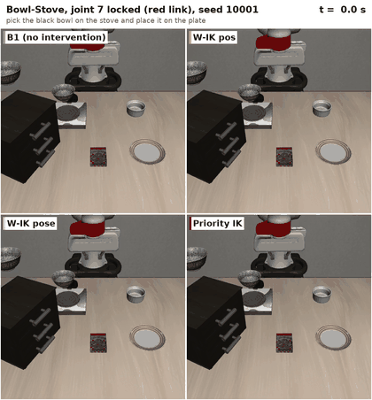
  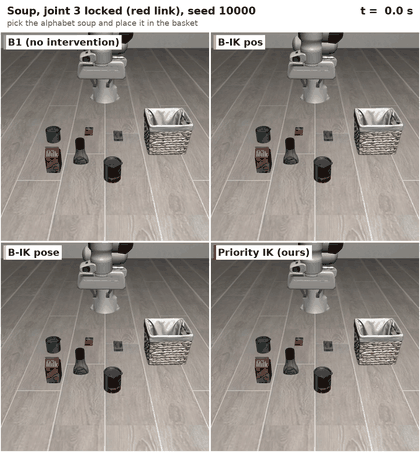
</p>
<p align="center"><sub>
Same seed and same diffusion samples for every method; only the execution-time correction differs (2× speed).
Left: Bowl-Stove, joint 7 locked. Right: Soup, joint 3 locked. Full video: <a href="paper/video/favor_supp.mp4"><code>paper/video/favor_supp.mp4</code></a>.
</sub></p>

## Highlights

- **No retraining.** Works on an unchanged pretrained joint-space Diffusion Policy. It needs only the fault description (which joint, and its admissible range).
- **Priority IK is best overall.** With a joint locked, success rises from 0.11 (no intervention) to **0.48**. The best fixed weighted-IK setting reaches 0.32, and denoising-time methods reach 0.19 (E-C-I) and 0.31 (RG-DDPM). Every comparison is paired over 4 tasks × 7 joints × 20 seeds.
- **No single weight works.** Over nine weighted-IK settings (orientation weight 0.05–1.0, with and without posture regularization), the best mean on locked J1/J3/J5/J6/J7 is 0.52, against 0.67 for Priority IK. Settings that solve proximal faults fail distal ones, and the reverse. Priority IK uses one setting for every joint.
- **How decides whether where helps.** Guidance inside the sampler with a *weighted* internal correction lowers success in front of Priority IK (0.67 → 0.52 on the same 20 conditions); the same guidance with a *prioritized* internal correction raises it to 0.73 (33 : 57 episodes, p = 0.015), at 3.3× the inference time. The prioritized internal correction also has no motion budget; `rg_prioint_b03` and `rg_wint_nob` separate the two. Reversing the priority to orientation first lowers success whatever the damping (0.55 and 0.52).
- **Limitation.** The fault description must be accurate. A 0.01 rad error in the assumed lock angle already drops success from 0.67 to 0.39.

## Problem and methods

<p align="center">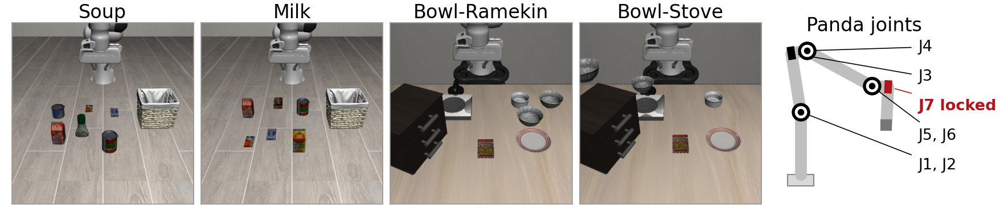</p>

**Setting:**
- Four LIBERO tasks (two from LIBERO-Object, two from LIBERO-Spatial), Franka Panda, 50 demonstrations per task.
- Joint-position control at 20 Hz.
- Diffusion Policy in joint space: DDPM with 100 steps, horizon 16, 8 steps executed per replanning.
- Healthy (no-fault) success on the evaluation seeds: Soup 0.85, Milk 0.80, Bowl-Ramekin 0.70, Bowl-Stove 0.85.

**Faults** (one joint at a time, onset at the episode's initial joint angle):

| Fault | Admissible motion of the faulted joint |
|---|---|
| mild / moderate / severe | 75 / 50 / 25 % of that joint's median demonstrated excursion |
| locked | none (0 %) |

Implementation: after every control step (20 Hz) a locked joint's position is reset to the lock angle and its velocity
set to zero; a range fault narrows the joint's MuJoCo limit (`jnt_range`) to the window. The joint-position controller
uses kp = 150 (robosuite's default of 50 left a 0.2 rad steady-state error on LIBERO's floor-mounted Panda).
Healthy (no-fault) success per task: `paper/tables/tab_nofault.csv`.

The policy outputs a chunk of joint targets $q^\star$, which the faulted robot cannot follow exactly. The methods differ in where they intervene:

| Where | Method | Idea | Code |
|---|---|---|---|
| none | **B1** | send the policy output as is | `docker/native_joint_policy.py` |
| sample selection | **Random-N**, **Select** | draw N=32 samples; pick at random or by a feasibility certificate | `native_joint_policy.py`, `fault_certificate.py` |
| during denoising | **E-C-I** | project each denoising step onto the fault constraint | `joint_eci_projector.py` |
| during denoising | **RG-DDPM** | reachability-guided sampling | `reach_guided.py`, `native_joint_policy_rg.py` |
| after sampling | **W-IK pos / pose** | weighted IK on the 6 healthy joints toward the end-effector pose implied by $q^\star$ | `ik_redistribution.py` |
| after sampling | **Priority IK** (position first) | the same retargeting with a strict task priority | `ik_priority.py`, `native_joint_policy_prio.py` |

**Priority IK.** The target is the pose the policy intended, $x^\star = \mathrm{FK}(q^\star)$. The faulted joint is held at its lock angle, and only the healthy joints move. With the damped pseudo-inverse $A^{+\lambda} = A^\top (A A^\top + \lambda^2 I)^{-1}$, each iteration takes

$$
\Delta q_1 = J_p^{+\lambda_1} e_p, \qquad N_1 = I - J_p^{+\lambda_1} J_p, \qquad
\Delta q = \Delta q_1 + N_1 \left(J_r N_1\right)^{+\lambda_2} \left(e_r - J_r \Delta q_1\right)
$$

- $e_p$ and $e_r$ are the position and orientation errors to $x^\star$; $J_p$ and $J_r$ are the corresponding Jacobian blocks over the healthy joints.
- $\lambda_1 = 0.01$, $\lambda_2 = 0.2$.
- Steps are clipped to joint limits; up to 30 iterations.

The orientation term can only use motions that leave the position unchanged. Unlike weighted IK, it can never trade position error for orientation error.

Task-priority IK itself is classical (Nakamura et al., 1987; Siciliano & Slotine, 1991). What this
repository contributes is the systematic comparison showing that this correction, with position first,
is the right one for a faulted joint under a pretrained policy, and the analysis of why.

## Results

All numbers are success rates over the same 20 test seeds (10000–10019) for every method. Comparisons are paired per episode (McNemar).

### Main comparison (4 tasks × 7 joints per fault level)

| Fault level | B1 | Random-N | Select | E-C-I | RG-DDPM | W-IK pos | W-IK pose | **Priority IK** | Best W-IK† |
|---|---|---|---|---|---|---|---|---|---|
| mild | 0.66 | 0.64 | – | 0.70 | – | **0.75** | 0.70 | 0.70 | 0.77 |
| moderate | 0.42 | 0.39 | 0.42 | 0.44 | 0.58 | 0.59 | 0.51 | **0.64** | 0.65 |
| severe | 0.28 | 0.26 | – | 0.31 | – | 0.45 | 0.39 | **0.58** | 0.54 |
| locked | 0.11 | 0.12 | 0.16 | 0.19 | 0.31 | 0.30 | 0.32 | **0.48** | 0.43 |
| all 112 | 0.37 | 0.35 | – | 0.41 | – | 0.52 | 0.48 | **0.60** | 0.60 |

Condition-level statistics (bootstrap CIs over conditions, sign and Wilcoxon tests with Holm correction, and a
mixed-effects logistic model with condition and episode effects) are in `paper/tables/tab_stats_condition.csv` and
`tab_glmm.csv`. They agree in direction with the paired counts but are more conservative. With Holm correction over
all rows, the condition-level tests stay significant against B1 (moderate to locked), RG-DDPM and W-IK pose (locked
and overall) and E-C-I (overall). Against W-IK pos they do not (overall Wilcoxon p = 0.064), although the bootstrap
95% CI of the mean difference excludes zero (+0.03 to +0.12) and the mixed model agrees from moderate faults on.
Against Best W-IK there is no overall difference, and at the mild level Priority IK is worse.

† Best W-IK picks the better of W-IK pos and W-IK pose for each condition after seeing the results. It is a reference, not an upper bound. Over all 112 conditions the paired counts (Priority IK only : other only) are 373:199 against W-IK pos (p = 3e-13), 408:137 against W-IK pose (p = 3e-32) and 231:225 against Best W-IK (p = 0.81). Condition-level tests that do not treat episodes of different conditions as independent are in `paper/tables/tab_stats_condition.csv`.

<p align="center">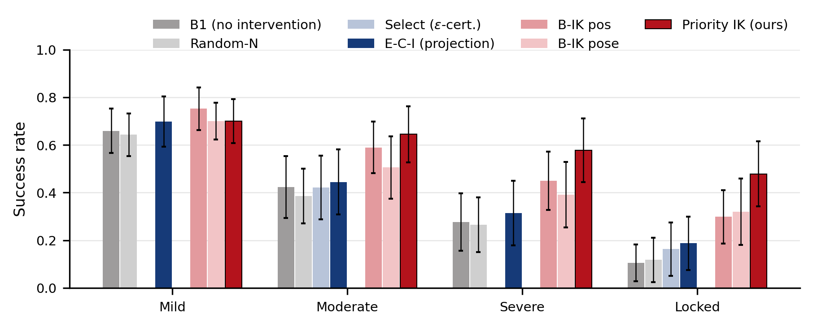</p>

Selecting among samples does not address the fault, and denoising-time guidance (RG-DDPM) performs on par with post-hoc weighted IK. Priority IK has the highest mean from moderate faults on. Exceptions: J4 range faults at every level and J2 at the mild level, where position-only weighted IK is better (see Limitations).

### Which joint fails matters, and weighted IK has to guess

<p align="center">
  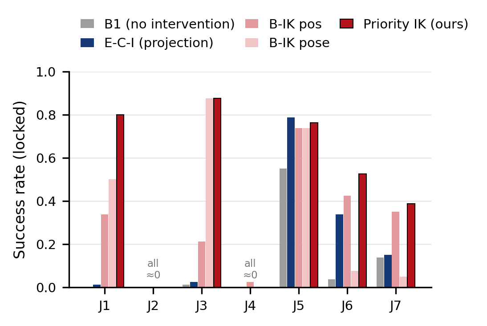
  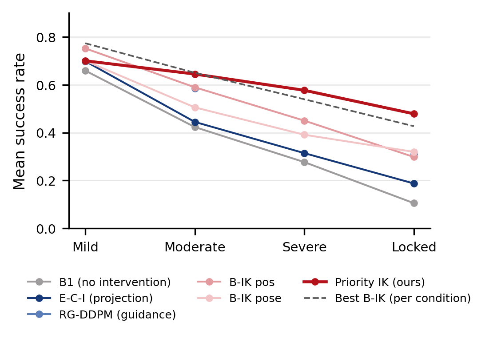
</p>

- **Distal faults (J6, J7):** position and orientation conflict. W-IK pose gives up centimetres of position to fix orientation and fails (0.07 / 0.05). W-IK pos keeps position but ignores orientation.
- **Proximal faults (J1, J3):** the trade-off reverses, and W-IK pos fails.
- **Priority IK** handles both with one setting (J1 0.80, J3 0.88, J6 0.53, J7 0.39).
- **J2 and J4** (shoulder and elbow pitch) cannot be compensated by any method when locked.

### Qualitative comparison

<p align="center">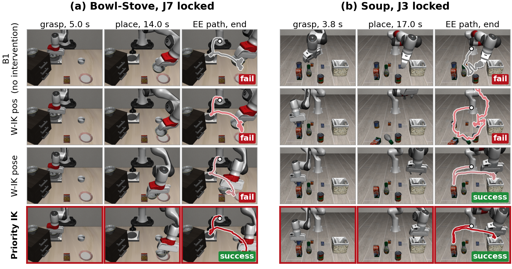</p>

- The panels show the same episode under every method; columns are taken at the same absolute times.
  - **(a) Distal fault:** both weighted IK settings fail.
  - **(b) Proximal fault:** position-only IK knocks objects over, while pose IK and Priority IK succeed.
- **How the episodes were chosen:** each shown baseline behaves as it does on most seeds of that condition.
- **Reproducibility:** every shown episode reproduces its sweep result exactly. Episodes are re-rendered from the original seeds, and `results/qual/compose_report.md` checks each one against the sweep JSON.

### Ablation: how the error is split, not where (locked, 28 conditions)

| Variant | Change | J6 | J7 | Mean | Prio : variant |
|---|---|---|---|---|---|
| **Priority IK** | – | **0.53** | **0.39** | **0.48** | – |
| Orientation-first priority | task order reversed | 0.28 | 0.14 | 0.39 | 74 : 26 (p = 1.7e-6) |
| RG-DDPM + Priority IK | sampling-time guidance added | 0.23 | 0.05 | 0.37 | 86 : 27 (p = 2.3e-8) |
| RG-DDPM | guidance + weighted IK (pose) | 0.11 | 0.05 | 0.31 | 124 : 30 (p = 8.9e-15) |
| W-IK pose | weighted IK | 0.07 | 0.05 | 0.32 | 120 : 31 (p = 1.5e-13) |

- **Reversed order:** reversing the priority costs most where position and orientation conflict (J6, J7).
- **Added guidance:** guidance inside the sampler hurts even with Priority IK at execution. RG-DDPM's internal correction is itself a weighted pose IK, so it bakes the J6/J7 trade-off into the trajectory before the post-hoc step can undo it.

### Weighted IK over its parameters (locked, 4 tasks × J1, J3, J5, J6, J7)

<p align="center">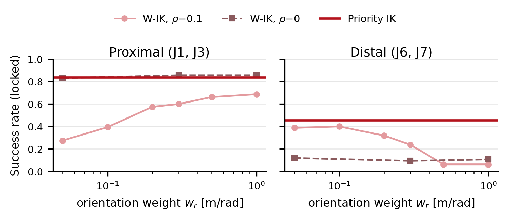</p>

| W-IK setting | proximal (J1, J3) | distal (J6, J7) | mean (20) | Prio : W-IK |
|---|---|---|---|---|
| w_r 0.05, ρ 0.1 (W-IK pos) | 0.28 | 0.39 | 0.41 | 148 : 45 |
| w_r 0.1, ρ 0.1 | 0.39 | 0.40 | 0.47 | 125 : 45 |
| w_r 0.3, ρ 0.1 | 0.60 | 0.24 | 0.51 | 102 : 38 |
| w_r 1.0, ρ 0.1 (W-IK pose) | 0.69 | 0.06 | 0.45 | 120 : 31 |
| w_r 0.3, ρ 0 | 0.86 | 0.09 | 0.52 | 78 : 17 |
| **Priority IK** | **0.84** | **0.46** | **0.67** | – |

Removing the posture term (ρ = 0) solves the proximal faults at any weight but collapses the distal ones. With ρ = 0
the Levenberg–Marquardt update is also almost undamped (ρ² is the damping; Priority IK uses λ₁² = 1e-4), so the run
`wik_w030_r000_dm4` (ρ = 0, damping 1e-4) separates the posture term from the numerical damping. All nine settings
(`paper/tables/tab_wik_sweep.csv`) are below Priority IK with p < 1e-7.

| Variant (same 20 conditions) | proximal | distal | mean | Prio : variant |
|---|---|---|---|---|
| Priority IK | 0.84 | 0.46 | 0.67 | – |
| Orientation first, position damped 0.2 / 0.01 | 0.87 / 0.84 | 0.21 / 0.13 | 0.55 / 0.52 | 74 : 26 / 81 : 20 |
| RG-DDPM (weighted internal) + Priority IK | 0.78 | 0.14 | 0.52 | 86 : 25 |
| RG-DDPM (prioritized internal) + Priority IK | 0.81 | 0.58 | **0.73** | 33 : 57 (p = 0.015) |

Inference time per policy call (5 parallel environments, RTX 3080; `paper/tables/tab_latency.csv`): B1 976 ms,
W-IK +21 to +66 ms, Priority IK +130 ms, RG-DDPM +2.3 s.

### Fresh-seed replication (n = 50, seeds 10020–10069)

| Condition | B1 | W-IK pos | W-IK pose | **Priority IK** |
|---|---|---|---|---|
| Soup J1 | 0.00 | 0.16 | 0.46 | **0.84** |
| Bowl-Ramekin J6 | 0.18 | 0.40 | 0.00 | **0.62** |
| Bowl-Stove J1 | 0.00 | 0.00 | 0.06 | **0.90** |
| Bowl-Stove J7 | 0.04 | 0.12 | 0.00 | **0.74** |
| Milk J3 | 0.00 | 0.02 | **0.92** | **0.92** |
| Milk J6 | 0.00 | **0.38** | 0.34 | 0.28 |
| Milk J7 | 0.26 | **0.50** | 0.00 | 0.44 |

The pattern holds on unseen seeds: Priority IK is best on 5 of 7 conditions. The two exceptions are Milk J6, where the intended pose is not reachable with the joint locked (IK residual > 24 mm for every method), and Milk J7, a statistical tie with W-IK pos (10 : 13, p = 0.68).

### Robustness to a wrong fault description

<p align="center">
  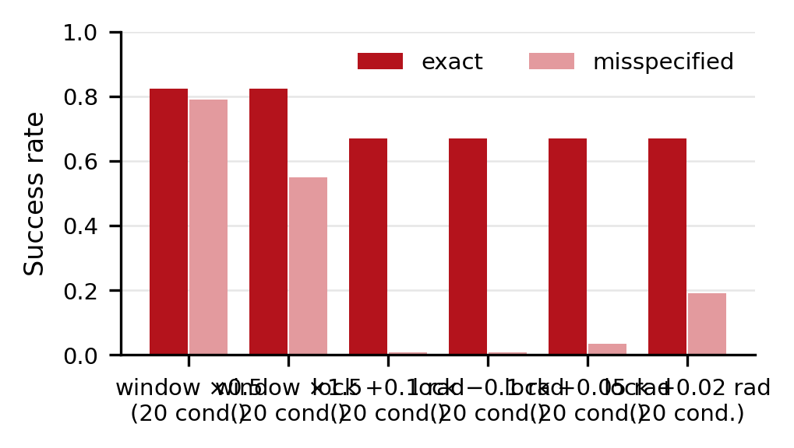
  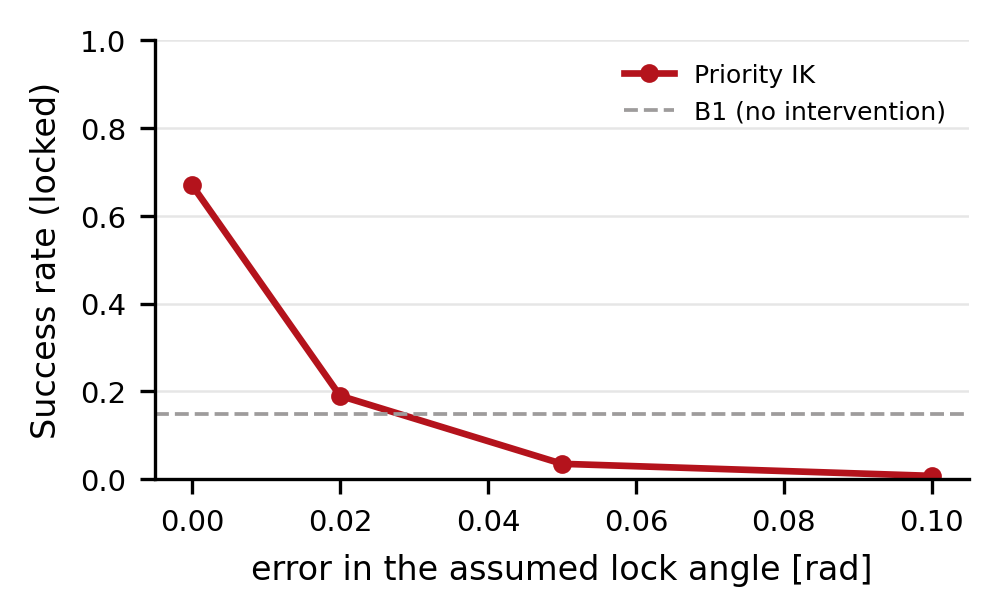
</p>

- **Range faults:** an admissible window assumed too narrow is harmless (0.82 → 0.79). One assumed too wide costs 0.27.
- **Locked faults:** the assumed lock angle must be accurate. Errors of 0.01, 0.02 and 0.05 rad drop success from 0.67 to 0.39, 0.19 and 0.03, and proximal joints degrade fastest.
- **Practical consequence:** the lock angle should come from the joint encoder, not from a nominal value.

### Why it works: a kinematic predictor

<p align="center">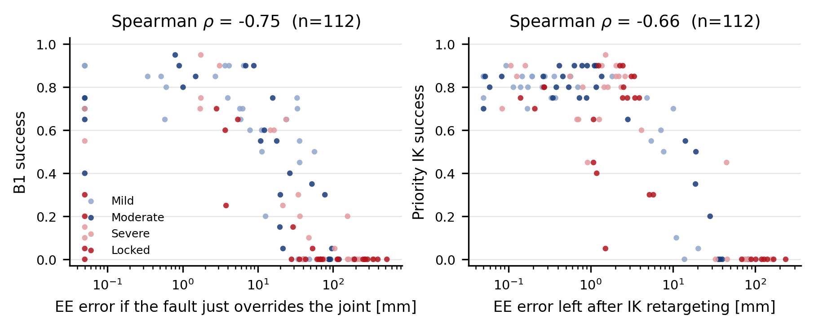</p>

Success is predicted by a purely kinematic quantity, computed without running the policy:
- Without intervention: the end-effector error the fault would cause (Spearman ρ = −0.75 with B1 success, 112 conditions).
- With Priority IK: the error left after retargeting (ρ = −0.66).
- Success collapses beyond roughly 10 mm of residual error. This boundary also explains the lock-angle sensitivity: proximal joints sit about 0.5 m from the end effector, so 0.02 rad is already about 10 mm.

The policy itself is not the bottleneck; recovering the intended end-effector motion is.

## Limitations

- **Simulation only.** All results are from LIBERO (robosuite/MuJoCo).
- **Fault description assumed known.** As in prior fault-adaptation work, the faulted joint and its admissible range are given. Detecting and identifying the fault is out of scope.
- **Lock angle must be precise.** Locked-joint performance depends on an accurate lock angle (see Robustness).
- **J4 range faults.** Priority IK is below position-only weighted IK on J4 at every range level (mild 0.60 vs 0.84, moderate 0.40 vs 0.51, severe 0.11 vs 0.28), and on J2 at the mild level. `paper/analysis/j4_range.md` relates this to the kinematic residual and to how far each method moves the healthy joints.
- **Unrecoverable faults.** Faults that remove a needed degree of freedom cannot be compensated by any training-free correction (locked J2/J4, Milk J6).

## Repository layout

```
docker/                       environment (Dockerfile.libero, compose) and all method / runner code
  assets/franka_panda.urdf      Panda kinematics used by every IK method (FK matches the sim to ~1 mm)
  fault_injector.py             locked / range_reduced / velocity_limited faults in MuJoCo
  favor_fault_runner.py         LIBERO rollout runner with fault injection and per-episode logging
  native_joint_policy*.py       policy wrappers: B1, Select, Random-N, E-C-I, W-IK, Priority IK, RG-DDPM, misspecification
  ik_redistribution.py          weighted IK (W-IK)
  ik_priority.py                Priority IK; ik_priority_rev.py = orientation-first ablation
  render_recorder.py            optional recorder for qualitative media (does not change what the policy sees)
  render_qualitative.py         re-runs selected sweep episodes with rendering on and checks them against the sweep
  run_libero_fault_sweep_*.py   sweep runners (one JSON per condition, per-episode success)
  run_libero_revision.py        revision runs: healthy success, W-IK w_r/rho sweep, order/damping and
                                prioritized-guidance variants (reach_guided_prio.py); bench_latency.py = per-call timing
  sweep_grid_libero*.py         task / joint / severity grids and the fixed test seeds
  tests/                        unit tests (E-C-I projection, Priority IK, priority order)
third_party/                  pinned upstream commits + patch to diffusion_policy (joint-space configs)
scripts_libero/               LIBERO -> robomimic conversion, evaluation, severity design, kinematic analysis
scripts_paper/                figures, tables, qualitative figures, video composition
paper/figs, paper/tables      generated figures (PDF/PNG) and tables (LaTeX/CSV)
paper/data                    every episode outcome (episodes.csv) and the kinematic analysis (layer1_v2.csv)
paper/analysis                J4 range-fault analysis, Fig. 3 outlier list
paper/multimedia              RA-L multimedia zip (video, ReadMe.txt, Summary.txt) and a <=10 MB video
paper/video                   supplementary video, per-scenario videos, README previews
run_*.sh                      training, sweeps, ablations, replication, qualitative media
```

## Setup

```bash
git clone https://github.com/lloydkwak/FAVOR.git && cd FAVOR
bash third_party/setup_third_party.sh        # LIBERO @8f1084e, diffusion_policy @20537a5 + favor.patch
docker compose -f docker/docker-compose.libero.yml build
```

Download the LIBERO demonstrations with LIBERO's own script. Then convert each task to the robomimic layout used by the joint-space pipeline, which stores absolute joint-position actions:

```bash
python scripts_libero/convert_libero_to_robomimic.py --libero-file <LIBERO demo .hdf5> \
    --out data/robomimic/datasets/libero_<task>/ph/image_abs.hdf5
```

| Task (this repo) | LIBERO task (suite / bddl) | Demos |
|---|---|---|
| `libero_alphabet_soup` | `libero_object/pick_the_alphabet_soup_and_place_it_in_the_basket.bddl` | 50 |
| `libero_milk` | `libero_object/pick_the_milk_and_place_it_in_the_basket.bddl` | 50 |
| `libero_bowl_ramekin` | `libero_spatial/pick_the_akita_black_bowl_between_the_plate_and_the_ramekin_and_place_it_on_the_plate.bddl` | 50 |
| `libero_bowl_stove` | `libero_spatial/pick_the_akita_black_bowl_on_the_stove_and_place_it_on_the_plate.bddl` | 50 |

The matching demo file is `<suite>/<task>_demo.hdf5`. A fifth task, `drawer`, was trained but is excluded from all reported results.

## Reproduce

```bash
./run_libero_all_tasks.sh                     # train the joint-space Diffusion Policies (4 tasks)
./run_main_sweeps.sh                          # all main sweeps -> results/
./run_x_queue.sh rg locked range:0            # RG-DDPM
./run_x_queue.sh prio_rev locked              # ablation: orientation-first priority
./run_x_queue.sh rg_prio locked               # ablation: RG-DDPM sampling + Priority IK execution
./run_x_queue.sh prio_b015 range:2            # appendix: Priority IK + motion budget
./run_ms_queue.sh none rs050:range:0 rs150:range:0 lop001:locked lop002:locked lop005:locked lop010:locked lom010:locked   # wrong fault description
./run_n50_queue.sh                            # fresh-seed n=50 replication
docker compose -f docker/docker-compose.libero.yml run --rm libero python /workspace/docker/run_libero_confirm_n50.py   # appendix: n=50 for B1 / Select / Random-N / E-C-I
docker compose -f docker/docker-compose.libero.yml run --rm -v $PWD/analysis_out:/workspace/analysis_out libero \
    python /workspace/scripts_libero/ik_select_and_layer1v2.py   # kinematic analysis -> analysis_out/layer1_v2.csv

python scripts_paper/make_paper_figures.py --results results --out paper   # figures and tables (host: numpy + matplotlib)
./run_revision_queue.sh                       # reviewer-requested runs: healthy success, W-IK w_r/rho sweep,
                                              # order/damping and prioritized-guidance variants, latency, failure-case video
python scripts_paper/revision_analysis.py --results results --out paper --glmm   # their tables, figure and analyses
python scripts_paper/export_episodes.py       # every episode outcome -> paper/data/episodes.csv (+ layer1_v2.csv)
./run_qual_media.sh                           # qualitative figures + videos (re-renders sweep seeds, checks them)
docker compose -f docker/docker-compose.libero.yml run --rm libero python /workspace/scripts_paper/make_preview_gif.py --video /workspace/paper/video

docker compose -f docker/docker-compose.libero.yml run --rm libero python /workspace/docker/tests/test_ik_priority.py
docker compose -f docker/docker-compose.libero.yml run --rm libero python /workspace/docker/tests/test_ik_priority_rev.py
```

`results/` is not tracked; every number, figure and video under `paper/` is regenerated from it.

## License

MIT, see [LICENSE](LICENSE).
